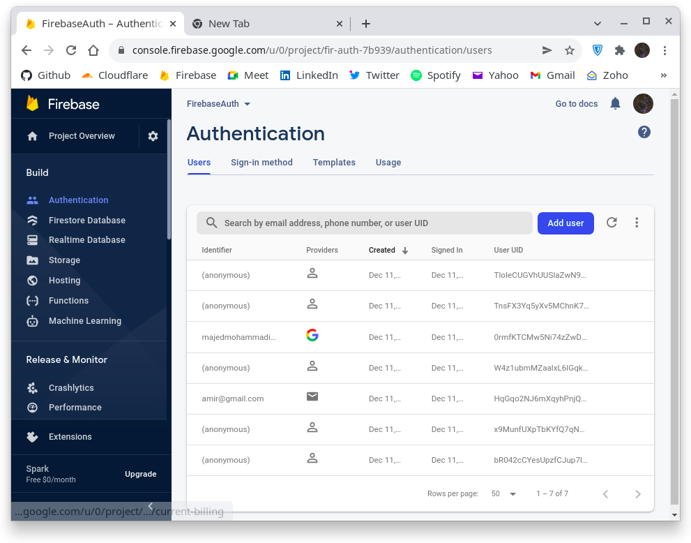
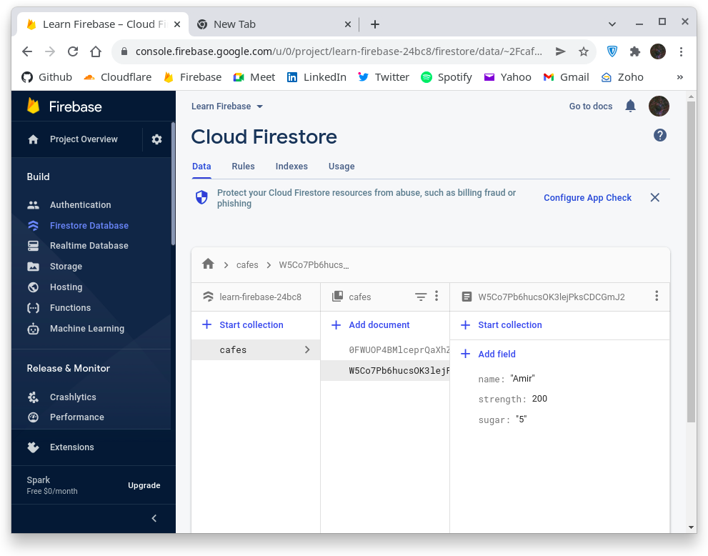
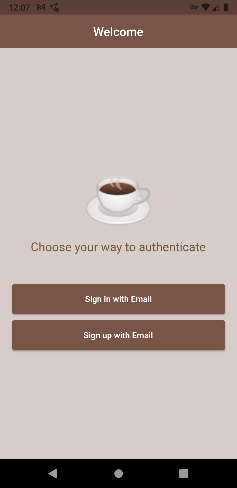
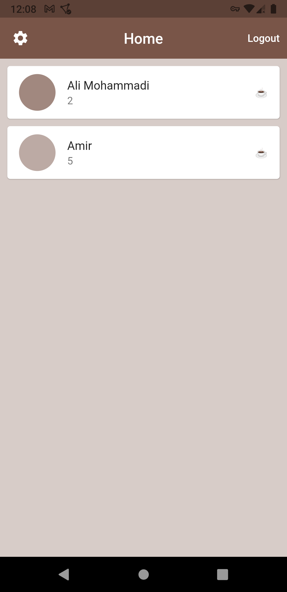
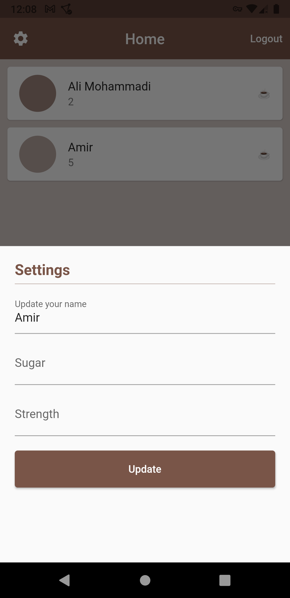
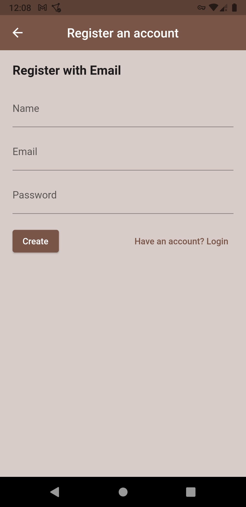
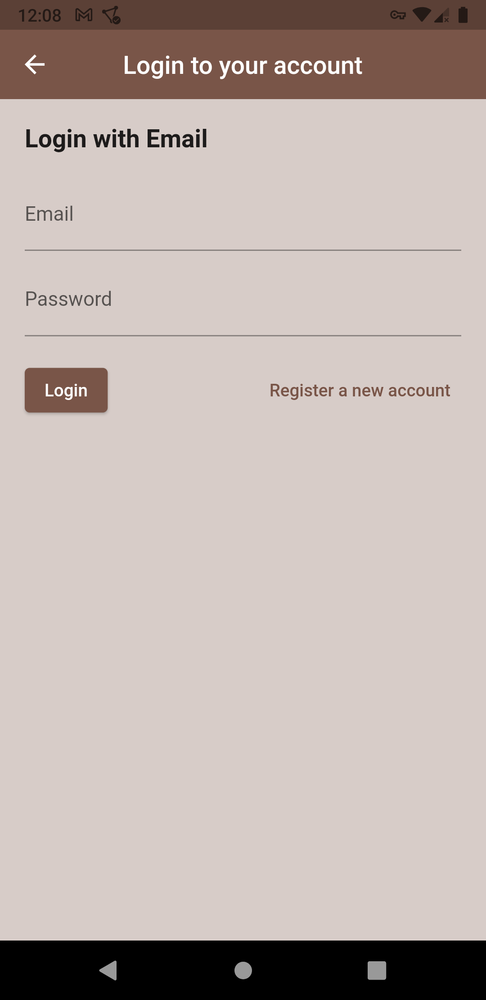

# Cafebase

Simple Firebase practical project.

### Lessons and what we covered

- Flutter
  - Bottom modal for settings
- Firebase setup
  - Setup for Android
- Firebase Authentications
  - Anonymous Authentication
  - Email Authentication
      - Email login
      - Email registration
  - Logout
- Firebase Firestore
  - Read date without specific query
  - Insert data *Create one new document*

### Images

- *Firebase Authentications*

- *Cloud Firestore*

- *Landing page*

- *Home page*

- *Landing page*

- *Registering page*

- *Login page*

### Next practical project?

In next project we will learn some new authentication ways and get deep in Firestore. Things we will cover is listed here:

- Flutter
  - Alert dialog for logout
  - Bottom navigation bar
  - Settings to show user image and other stuff
- Firebase setup
  - Setup for iOS
- Firebase Authentications
  - Google Authentication
  - Access to user objects
    - Name
    - Photo
    - Email
    - Phone
- Firebase Firestore
  - Read date with specific query
  - Update a document

[Second practical project](https://github.com/BlackIQ/Firebase-Practical-2)